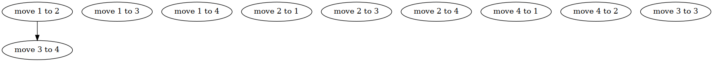

# keyframe

This project is based on the idea we can interpolate code between **states**, including function calls.

I use the A* algorithm to generate assembly instructions between states and function calls.

See [samsquire/sliding-puzzle-codegen-memory](https://github.com/samsquire/sliding-puzzle-codegen-memory) for an example in Python.

# some early diagrams

